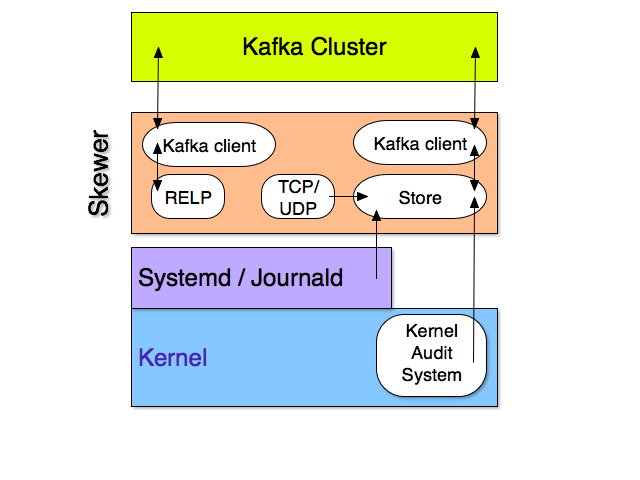

# Skewer, a Syslog to Kafka gateway

Skewer is a syslog server that forwards the messages to a Kafka cluster.

## Status

Pretty much experimental. Not much tested. Probably some bugs. Don't be afraid
to post bugs and ask questions.

## Features

-   Listens on TCP, UDP or RELP
-   Can fetch logs from Kafka
-   Can fetch log messages from Journald (on Linux)
-   Can fetch audit logs from the kernel (on Linux, by Journald)
-   Can forward logs to Kafka, to another syslog server, or to Graylog
-   Can write logs on the local filesystem
-   Configuration can be provided as a configuration file, or optionally
    fetched from Consul (not really finished)
-   Can register the TCP and RELP listeners as services in Consul
-   Custom message parsers and filters can be defined through Javascript
    functions
-   The client connections to Consul, Kafka or remote syslog servers can be
    secured with TLS
-   The TCP and RELP services can be secured in TLS
-   Works on Linux and MacOS (not tested on *BSD), does not work on Windows

## Security

-   Privilege separation: a multi-process architecture is implemented.
-   Under Linux, the processes are contained in kernel namespaces ("better chroot").
-   Under Linux, seccomp is used to restrict the available syscalls.
-   Under Linux, capabilities are used so that the daemon can be safely started
    under root.
-   The IPC is based on anonymous unix sockets
-   Furthermore, the IPC is encrypted using a per-session secret.
-   The embedded database that transiantly store logs can encrypt the logs.
-   Not done: Hashicorp's Vault integration.

## Use cases

-   Locally, between rsyslog (or syslog-ng) and Kafka. On Linux, on each
    server rsyslog is usually the system syslog daemon. You can run skewer on
    each server, alongside rsyslog, to push messages to Kafka. To ensure that
    no message gets lost, use RELP between rsyslog and skewer.

-   Centrally, between rsyslog (or syslog-ng) and Kafka. If the log trafic is
    not so big, you can run a single skewer instance centrally. Each local
    rsyslog sends the messages to the central skewer, using RELP. The central
    skewer forwards messages to the Kafka cluster. (As rsyslog has a failover
    capability for log forwarding, you could also install a pair of skewers on
    different machines.)

-   Locally, as the unique system syslog server. Well. Don't do it right now.
    Skewer is not enough tested for that, and does not *yet* have a local export
	function to write logs to /var/log. But that's definitely on the
    roadmap.

## How it works

-   skewer implements the standard syslog protocols for TCP and UDP.

    When receiving a message on TCP and UDP, there is no way to notify the
    emitter that the message has been correctly received. To avoid message
    loss, such messages are first stored in an embedded database (the Store),
    persisted on disk. The messages are removed from the Store only
    after Kafka has acknowledged them. When some message fails to be transfered
    to Kafka, `skewer` keeps it and retries later.

-   skewer implements the RELP (aka reliable syslog) protocol that was defined
    by rsyslog. 

    With RELP, we can inform the emitter (`Rsyslog`) when a message has been
    correctly received by Kafka. The emitter is responsible to keep the
    message as long as we don't notify him. So in this case, there is no
    'Store' mechanism involved.

-   skewer uses the C Journald API to fetch messages from Journald. Journald
    messages are push to the Store, and afterwards sent to Kafka.

-   The Store owns a single Kafka producer to forward TCP/UDP/Journald/Audit
    messages.

## Building

-   On Linux systemd headers and libseccomp headers are needed
-	Go Dependencies are vendored.
-	On linux you will need to install libsystemd header files (needed to
	query journald)
-	You can `go get github.com/stephane-martin/skewer` or `git clone ...` and
	`go build`.

## Configuration

The configuration file directory location is specified by the `--config`
command line flag (by default `/etc`). Inside that directory, the configuration
file must be called `skewer.toml`.

See the example file `skewer.example.toml` in source root directory for the
various options.

You can also specify a Consul server through the command line flags. In that case,
the configuration will be fetched from Consul. When the configuration changes in
Consul, the services will be restarted accordingly (only the Store configuration
is not dynamic).

The configuration must be given as a tree in Consul KV. For example:

> skewer/syslog/A/bind_addr 0.0.0.0
>
> skewer/syslog/A/port 2514
> 
> skewer/syslog/B/bind_addr 0.0.0.0
>
> skewer/syslog/B/port 3514
> 
> skewer/kafka/brokers ["kafka1","kafka2","kafka2"]

## Commands

Flags are documented in the command line help.

-   `skewer default-config`

    Prints a default configuration in TOML syntax.

-   `skewer print-config [--config dirname]`

    Print the current configuration

-   `skewer serve [--config dirname] [--test]`

    The main command. Creates the services specified in the configuration,
    listens for new messages on the network services, fetch audit logs and
    journald messages, forward everything to kafka.

    You can provide a `--test` command line flag to print the collected
    messages instead of sending them to Kafka.

    To make it simple it is possible to launch skewer as root. It will first drop the
    unneeded privileges, switch to a normal user, and then start operations 
    (see `sys/linux_privileges.go` for details about the privileges dropping).

    `sudo skewer serve --uid nonprivuser --gid nonprivgroup`

-   `skewer make-secret`

    Generates a secret that you can use in the Store configuration, so that
    log messages are not written in clear text on disk.
